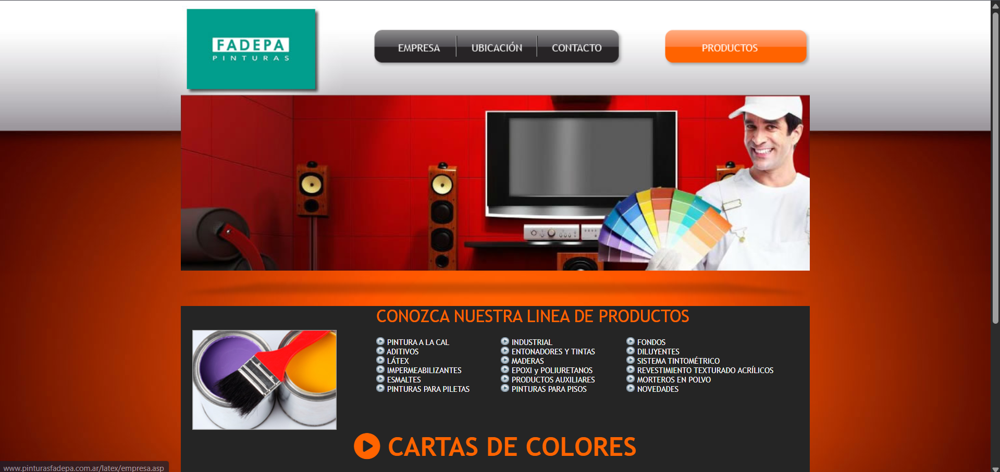
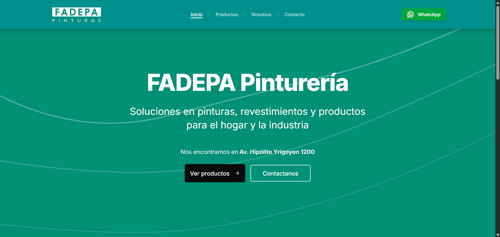
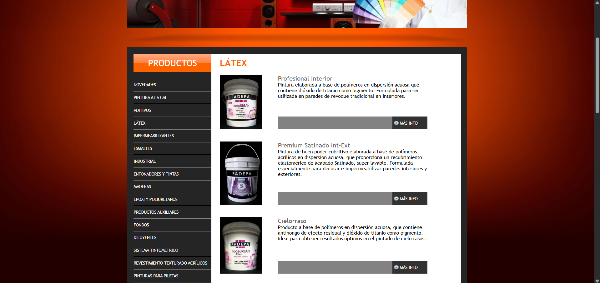
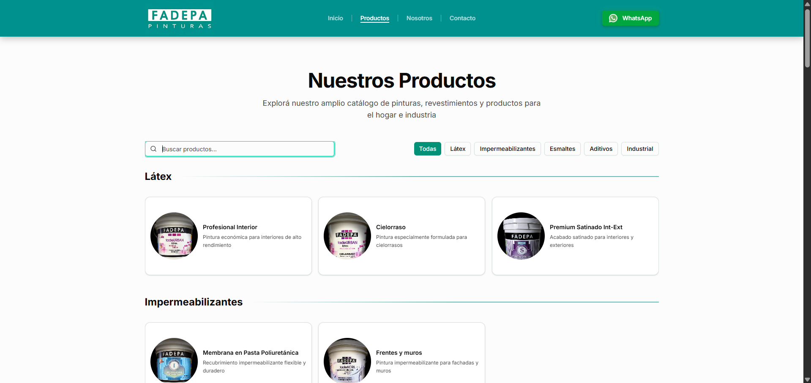
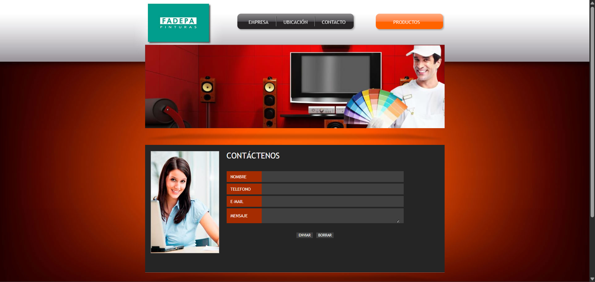
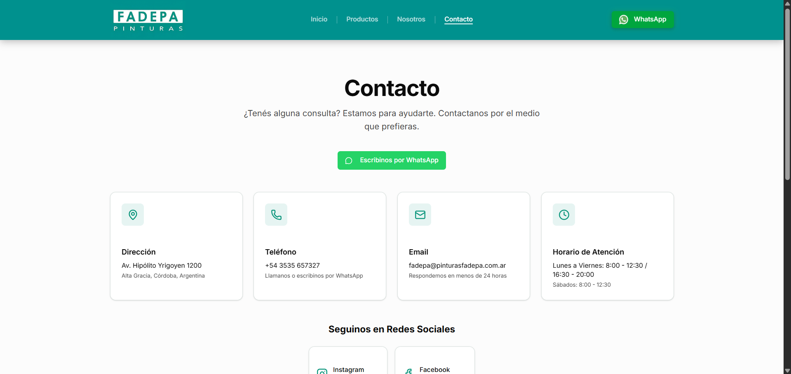

# Rediseño Web - Pinturería FADEPA

## Descripción
Este proyecto presenta una propuesta de rediseño web para FADEPA Pinturería, un negocio familiar de Alta Gracia, Córdoba.

El objetivo fue modernizar y mejorar la web anterior para ofrecer una experiencia más clara, actual y orientada al usuario, con foco en:

- diseño visual moderno
- mejor usabilidad
- organización más eficiente del contenido
- visualización de productos más simple e intuitiva

Link desarrollo: https://fadepa.netlify.app/

## Antes vs Después
Comparativa visual entre la web original y la propuesta de rediseño

### Inicio
**ANTES**  

**DESPUÉS**  

### Productos
**ANTES**  

**DESPUÉS**  

### Contacto
**ANTES**  

**DESPUÉS**  

Principales mejoras implementadas:

- estética más moderna y consistente
- contenido mejor jerarquizado por secciones
- navegación más clara entre páginas clave
- mejor experiencia en dispositivos móviles

## Tecnologías utilizadas
- Next.js 16 (App Router)
- React 19
- TypeScript
- Tailwind CSS v4
- shadcn/ui + Radix UI
- Lucide React (iconografía)
- React Hook Form + Zod
- Vercel Analytics
- pnpm

## Funcionalidades
- Catálogo de productos por categorías
- Búsqueda de productos por nombre y descripción
- Filtros por categoría
- Vista detallada de producto en modal
- Visualización ampliada de imágenes de producto
- Navegación principal clara (Inicio, Productos, Nosotros, Contacto)
- Integración directa con WhatsApp para consultas
- Sección de contacto con datos, redes y mapa embebido
- Diseño responsive (mobile-first)
- Tipografía y sistema visual consistentes

## Decisiones técnicas
- Se eligió Next.js con App Router para una estructura escalable, rutas claras y buen rendimiento en frontend moderno
- Se utilizó TypeScript para mejorar la mantenibilidad del código y reducir errores por tipado
- Se trabajó con Tailwind CSS y componentes reutilizables de shadcn/ui para acelerar desarrollo, mantener consistencia visual y facilitar iteraciones UI/UX
- El catálogo se modeló con interfaces tipadas (`Product` y `Category`) y datos centralizados para simplificar filtros y renderizado
- Se incorporó Vercel Analytics para poder medir uso real y tomar decisiones de mejora basadas en datos

## Objetivos del rediseño
- Modernizar la estética general del sitio
- Mejorar la experiencia de usuario en navegación y lectura
- Facilitar el acceso al catálogo de productos
- Optimizar la consulta desde dispositivos móviles
- Fortalecer la presencia digital de FADEPA con una interfaz actual

## Estado del proyecto
Propuesta conceptual y prototipo funcional de rediseño web, orientado a validación visual, de usabilidad y organización de contenido para FADEPA

## Autor
- Nombre: Esteban Granja
- Rol: Desarrollador Frontend
- LinkedIn: linkedin.com/in/estebangranja/
- Email: tebygranja@gmail.com